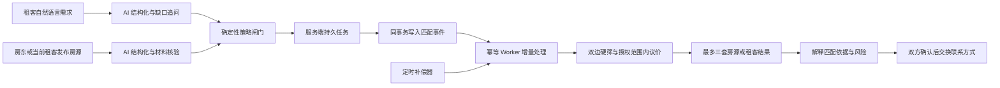
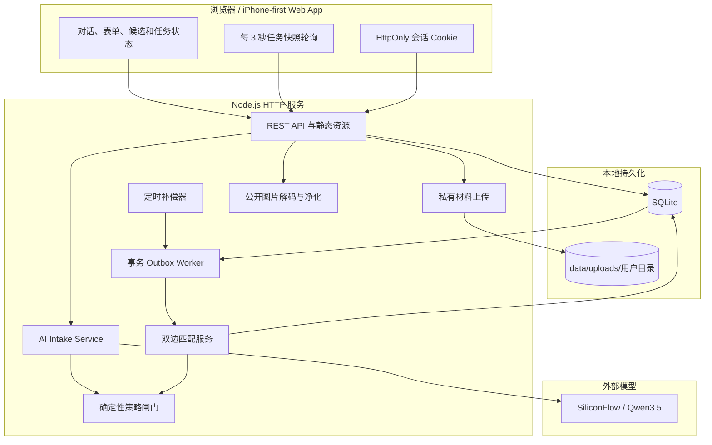

# 住哪儿 · AI 原生租房匹配平台

> 让租客和房东分别把真实需求交给 AI 分身。分身负责补全信息、验证边界、持续匹配和私密议价，用户直接从筛选后的结果开始决策，而不是先经历几十轮低效聊天。

这是一个 iPhone-first 的双边租房匹配产品原型，也是一条可以本地运行、可测试、可审计的端到端链路。浏览器负责对话式交互，Node.js 服务负责会话、材料、任务和候选持久化，SQLite 保存业务状态，Qwen3.5 负责运行时结构化，确定性策略层负责硬条件、角色、收费和隐私边界。


## 目录

- [项目要解决的问题](#项目要解决的问题)
- [产品核心闭环](#产品核心闭环)
- [真实操作演示](#真实操作演示)
- [已经实现的能力](#已经实现的能力)
- [系统架构](#系统架构)
- [AI 与规则如何协作](#ai-与规则如何协作)
- [持续双边匹配](#持续双边匹配)
- [隐私、安全与材料核验](#隐私安全与材料核验)
- [本地运行](#本地运行)
- [API 说明](#api-说明)
- [数据模型](#数据模型)
- [测试与评测](#测试与评测)
- [项目结构](#项目结构)
- [当前边界与生产化路线](#当前边界与生产化路线)
- [常见问题](#常见问题)

## 项目要解决的问题

传统租房平台通常把“信息发布”当成终点：租客发布找房帖，房东发布房源帖，之后双方仍要重复确认预算、入住日期、室友、设施、收费、可看房时间和租期。大量对话只是字段补录，并没有真正提高决策效率。

“住哪儿”的产品假设是：

1. 租客不应该浏览几百套房源后逐个询问，而应该先把需求和授权边界说清楚。
2. 房东或当前租客不应该反复回答相同问题，而应该一次性完善房源事实和出租资格。
3. AI 可以负责信息结构化、缺口追问、匹配解释和授权范围内的非约束性议价。
4. 硬条件、收费限制、身份角色和私密价格不能只依赖模型判断，必须由确定性规则复核。
5. 匹配不是一次性搜索。只要任务仍然有效，新供给或新需求到达后就应该重新计算并更新结果。
6. 双方真人应在候选已经合适、条件基本谈妥后再介入，而不是把时间消耗在前置闲聊中。

## 产品核心闭环



用户实际经历的是：

`说清楚需求 → 确认 AI 整理结果 → 发布持续任务 → 直接查看候选 → 确认后再联系`

系统内部经历的是：

`自然语言 → 结构化字段 → 规则复核 → 私密授权 → 双边匹配 → 候选脱敏 → 结果持续更新`

## 真实操作演示

以下截图均来自本仓库在 `MARKET_MODE=demo` 下运行的真实浏览器操作，展示的是明确标记的演示 fixture 和仓库测试图片。截图不代表真实房源或官方核验，也不包含真实身份证、租约、个人联系方式、Cookie、API Key 或本机数据路径；demo fixture 永不生成可确认案例和联系人授权。

### 1. 租客端：从一句话到持续找房

租客可以用自然语言描述区域、预算、入住时间、通勤、合租、租期和设施。Qwen3.5 先整理字段，规则层再复核明确事实，用户仍可在发布前修改。

| AI 结构化需求 | 最终任务授权 |
|:---:|:---:|
|  |  |

发布后任务不会把一次扫描伪装成最终结果。首页明确显示“仍在持续找房”，候选页显示“持续匹配中”。

| 持续匹配状态 | 已筛选的候选房源 |
|:---:|:---:|
|  |  |

候选详情不是简单展示房源原文，而是按当前租客任务重新组织：展示为什么合适、需要留意什么、资料来源、当前意向租金和分身协商过程。

| 匹配依据与核验来源 | 两个分身的协商记录 |
|:---:|:---:|
|  |  |

### 2. 出租端：从房源描述到持续找租客

发布者只能选择“房东本人”或“当前租客”。自然语言会被整理成位置、挂牌价、最低授权价、入住时间、租期、楼层、室友和设施等字段。

| AI 整理房源 | 确认房间与设施 |
|:---:|:---:|
|  |  |

出租任务必须提交身份材料、发布角色材料、出租权材料和房屋现场照片。服务端会验证材料是否属于当前会话、类型是否对应，不能通过篡改前端布尔值绕过。

任务发布后会反向扫描活跃租客任务。公开卡片只显示匿名租客别名、租期、入住日期和双方已能接受的意向租金，不公开租客预算上限。


### 3. 统一视觉与小屏适配

当前界面采用暖白、炭黑和中性灰作为主视觉，绿色、黄色和红色只承担连接成功、演示提醒、警告与错误等状态语义。首页、任务创建、消息、候选、详情、看房安排和数据洞察共用同一套表面色、边框、阴影与交互反馈，页面之间保持一致的视觉层级。

界面同时覆盖 390 × 844 的主移动视口和 320 × 568 的紧凑视口。底部导航、任务确认按钮和详情页顶部操作均锚定在应用容器内；小屏首页会压缩角色展示区，确保“有房要出租”和主操作按钮保持可见。


## 已经实现的能力

### 对话式需求完善

- 租客自然语言解析：区域、预算区间、入住窗口、最大通勤、整租或合租、室友性别、租期、楼层、朝向、看房时间和设施。
- 出租自然语言解析：发布角色、位置、挂牌价、私密最低授权价、可入住时间、房间事实、室友、设施和费用。
- 配置 SiliconFlow 后使用 `Qwen/Qwen3.5-35B-A3B` 完成运行时结构化。
- 模型不可用时自动回退到确定性解析，页面标记“确定性解析 · 安全模式”。
- 模型返回结果只能补充缺失值，不能覆盖规则已经从原话确认的硬事实。

### 双边持续匹配

- 找房任务扫描房源，出租任务反向扫描租客。
- “我的任务”以服务端列表为事实源，可在多个找房和出租任务之间切换，并暂停或恢复持续匹配。
- 任务与匹配详情使用同会话深链；刷新、浏览器返回和前进会恢复选中状态，非法或越权链接回退到任务中心且不泄露内容。
- 新供给到达后立即更新相关租客任务。
- 新租客到达后立即更新相关出租任务。
- 任务与 `task.match_requested` 在同一事务提交；单进程 worker 只评估城市、位置和价格粗筛后的受影响任务对。
- 定时器只回收超时租约、处理到期任务、补发异常遗漏事件并清理过期数据，不再每 10 秒重跑全市场；前端每 3 秒拉取任务快照。
- 任务支持 `active`、`paused`、`closed` 和自动过期语义。
- 候选使用版本号和审计事件记录更新，不依赖纯前端动画制造进度。

### 匹配与协商

- 位置、价格、入住日期、合租类型、室友性别、通勤和强制设施执行硬筛。
- 角色冲突、中介代发、禁止收费、失效材料和异常图片进入隔离或拒绝路径。
- 议价只在租客私密最高预算和出租方私密最低授权价之间进行。
- 每个接收方最多交付三条候选，并尽量覆盖“综合最合适”“预算更轻”“居住条件更好”等不同选择理由。
- 公开结果只保留最终意向租金，不公开双方授权边界。

### 房源发布门槛

- 只接受房东本人或当前承租人发布。
- 当前租客需要有效租约及转租授权；房东需要产权与角色材料。
- 必须上传身份、角色、出租权和现场照片四类材料。
- 禁止中介费、服务费、信息费、带看费和签约费。
- “不收任何中介费服务费”不会被误判为中介；“中介代发”即使声称零收费仍会触发角色风险。

### 公开房源图片

- 私密身份、出租权和现场核验材料与公开房源图片使用不同的存储和读取路径。
- 公开图片必须由发布者明确授权；服务端不相信扩展名或声明 MIME，而是用 Sharp 真实解码。
- JPEG、PNG 和 WebP 会自动旋转、限制最长边并重新编码为 WebP；EXIF、GPS、XMP 和 IPTC 元数据不会进入公开 derivative。
- 候选接口只返回受控媒体 ID、说明和尺寸，不返回私密原图、核验材料 ID 或任何磁盘路径。
- 没有公开实拍时显示中性占位，不拿演示样板房冒充用户房源。

### 结果与隐私

- 租客候选隐藏房东最低授权价和精确地址。
- 房东候选隐藏租客目标预算和最高预算。
- 联系方式默认锁定；只有双方确认同一条款哈希、服务端授权仍有效且任务仍 active 时才能按当前会话读取对手方联系人。
- 用户可查看匹配依据、未知项、风险提示和结构化协商记录。

### 无聊天的双边闭环

- 每一对真实租客任务和真实房源任务只有一个服务端权威案例；“真实双边”指任务、案例、条款、确认、授权和失效状态都真实持久化，不代表身份、产权或房源已经接入官方核验。
- 阻断未知项只向能回答的一方提问，另一方只看到待补充数量与类别，答案写入字段版本后自动触发重算。
- 双方必须确认同一条款 version/hash；单方确认仍锁定联系人，第二方确认后才由服务端签发短期授权。
- 看房时间以持久提议和接受状态流转；任务暂停、关闭、过期或输入变化会取消未完成安排并撤销联系人授权。
- 消息中心保存新候选、待确认、确认完成和 48 小时续期提醒；任务默认有效 14 天，可续期，过期任务保持只读并可克隆。
- 举报进入持久复核队列；产品指标只从服务端事件聚合，不由前端估算“节省消息数”。

## 系统架构



### 主要模块

| 模块 | 文件 | 职责 |
|:---:|:---:|:---:|
| 浏览器应用 | `src/app.mjs` | 信息架构、找房与出租流程、任务恢复、候选和交互 |
| 样式系统 | `src/app.css` | iOS-first 布局、响应式设备框、匹配动画和组件状态 |
| API 客户端 | `src/api-client.mjs` | 会话、AI intake、材料上传、任务创建和快照请求 |
| HTTP 服务 | `server.mjs` | 静态资源、REST API、会话授权、上传和调度器 |
| Intake 服务 | `src/server/intake-service.mjs` | 规则解析、模型调用、保守合并和回退 |
| 匹配服务 | `src/server/matching-service.mjs` | 双边任务扫描、候选增量更新、公开结果脱敏 |
| Outbox 仓储 | `src/server/outbox-repository.mjs` | 事件去重、短租约领取、退避重试、失败告警和 worker 健康数据 |
| 匹配 Worker | `src/server/matching-worker.mjs` | 增量消费事件、配对作业幂等和旧版本结果丢弃 |
| 媒体服务 | `src/server/media-service.mjs` | 图片解码、像素与动画限制、元数据清除和受控读取 |
| 媒体仓储 | `src/server/media-repository.mjs` | 公开授权、内容哈希、候选可见性和清理队列 |
| SQLite 仓储 | `src/server/database.mjs` | 会话、材料、任务、候选和审计事件持久化 |
| 需求解析 | `src/demand-parser.mjs` | 租客文本的字段与缺口识别 |
| 供给解析 | `src/supply-parser.mjs` | 房源字段、角色、收费和风险识别 |
| 策略引擎 | `src/simulation-engine.mjs` | 风控、硬筛、议价、举报和候选选择 |
| AI 契约 | `src/ai/` | Prompt、SiliconFlow 客户端与模型出站策略 |
| 测试市场 | `src/marketplace-corpus.mjs` | 100 条房源和 100 条租客测试语料 |

更完整的状态机、表结构、生产架构和权限设计见 [产品与系统架构文档](./docs/product-architecture.md)。

## AI 与规则如何协作

本项目没有把“模型说可以”当成最终业务判断。运行时采用两层结构：

### 第一层：Qwen3.5 负责理解自然语言

- 识别口语、同义词、省略表达和复杂句子。
- 输出符合约定 JSON 结构的需求或房源字段。
- 给出需要进一步确认的问题。
- 生成面向用户的简短结构化摘要。

### 第二层：确定性规则负责业务边界

- 原话中已经明确的预算、日期、角色、费用和设施不能被模型覆盖。
- 模型不能把中介、收费或角色冲突改写成合规房源。
- 模型不能把超过租客最高预算或低于出租方最低授权价的方案交付出去。
- 最终候选会再次检查硬条件和私密词泄露。
- 模型超时、限流或返回非 JSON 时自动使用规则解析结果。

这使系统同时获得自然语言理解能力和可审计的业务安全边界。

## 持续双边匹配

任务创建与匹配请求事件会在同一 SQLite 事务中提交；请求内会立即驱动 worker 消费一次，并保存：

- 已扫描数量 `scanned`；
- 合适数量 `suitable`；
- 候选版本 `candidate_version`；
- 最近匹配时间 `last_match_at`；
- 创建、运行、候选变化和过期等审计事件。

之后有两类触发器：

1. **事件触发**：创建、字段新版本、暂停、恢复、关闭、到期和公开媒体变化写入 outbox，worker 只计算受影响集合。
2. **时间补偿**：调度器回收超过锁租期的 `processing` 事件、停止到期任务、为长期未匹配且无 pending event 的异常任务补事件，并清理过期授权、会话和媒体 tombstone。

每个任务事件使用 dedupe key 去重，每个任务对使用双方任务 ID、双方输入版本和 evaluator 版本组成固定 job key。候选继续使用 `receiver_task_id + counterparty_id` 去重；处理期间版本变化的旧结果会被丢弃，新版本事件负责重算。SQLite 阶段通过 `BEGIN IMMEDIATE` 和短租约保证单机多 worker 实例不会同时领取同一事件，不宣称已经具备多机高吞吐能力。

## 隐私、安全与材料核验

### Key 与本地配置

- 模型 API Key 和联系人加密密钥都不写入源代码、README、浏览器或数据库。
- 模型 Key 从进程环境变量或本地 Key 文件读取；联系人密钥只从服务端环境读取。
- `.env.local` 被 Git 忽略，可保存 Key 文件路径、模型名和本机生成的联系人密钥。
- `.env.example` 只提供占位配置，不包含任何真实凭证。
- real 模式必须配置 32 字节 base64 `CONTACT_ENCRYPTION_KEY`；联系人使用 AES-256-GCM 和逐条随机 nonce 加密。

### 用户和任务隔离

- 浏览器首次进入时创建随机会话 secret，并只通过 HttpOnly、SameSite Cookie 发送。
- 服务端只保存 secret 哈希；浏览器 JavaScript 和 localStorage 都拿不到原值。
- 任务、材料和候选读取都验证当前会话所有权。
- 私密核验材料按用户隔离；公开图片原件进入 `private-originals/`，净化结果进入 `public-derivatives/`，两个目录均不做静态映射。
- 精确地址、材料存储路径和私密价格不会进入公开候选负载。

### 演示安全提醒

当前材料上传只完成“文件存在、类型正确、属于当前会话”的闭环验证，不等于公安、产权或电子签章系统的真实性核验。请勿在本地演示环境上传真实身份证、房产证、租约或其他敏感材料。

## 本地运行

### 环境要求

- Node.js 24 推荐；Node.js 22+ 可运行当前代码。
- npm。
- macOS、Linux 或 Windows 均可；截图中的界面为桌面浏览器中的 iPhone-first 布局。
- 必填：本机生成的联系人加密密钥；real 模式缺少或格式错误时拒绝启动。
- 可选：SiliconFlow API Key，用于启用 Qwen3.5；没有模型 Key 仍可使用安全解析模式。

SQLite 使用 Node.js 内置 `node:sqlite`；公开图片处理使用已锁定版本的 `sharp`，安装后会按当前 macOS/Linux 平台加载对应二进制。

### 1. 克隆项目

```bash
git clone https://github.com/tank798/AI-native-rental-platform.git
cd AI-native-rental-platform
```

### 2. 配置本地安全密钥；按需启用 Qwen3.5

复制示例配置：

```bash
cp .env.example .env.local
```

编辑 `.env.local`：

```dotenv
CONTACT_ENCRYPTION_KEY="把 openssl rand -base64 32 的输出填在这里"
SILICONFLOW_API_KEY_FILE="/absolute/path/to/siliconflow-api-key.txt"
SILICONFLOW_MODEL="Qwen/Qwen3.5-35B-A3B"
```

联系人密钥可以这样生成：

```bash
openssl rand -base64 32
```

每套已存在的数据必须继续使用原密钥，否则历史联系人密文无法解密。生产环境应改用 KMS 包络加密或独立 secrets 服务。

Key 文件可以只包含 Key，也可以写成：

```dotenv
SILICONFLOW_API_KEY=your_key_here
```

不要把真实 Key 写入 `.env.example`、README 或任何准备提交的文件。

### 3. 启动

```bash
npm start
```

打开：<http://127.0.0.1:4173>

正常启动时终端会显示：

```text
住哪儿服务已启动：http://127.0.0.1:4173
运行时 AI：Qwen/Qwen3.5-35B-A3B
```

若未配置模型，应用仍能运行，页面会显示“确定性解析 · 安全模式”。

### 4. 推荐体验顺序

1. 在首页输入一条包含预算、入住日期和通勤限制的找房需求。
2. 检查 AI 整理的字段，补齐或修改后确认任务。
3. 勾选授权并发布，观察首页持续匹配状态。
4. 打开候选页，进入房源详情查看依据和协商记录。
5. 点击底部加号，新建“我要出租”任务。
6. 输入房源、角色、租金、入住、室友和设施。
7. 使用测试图片完成四类材料演示，不要上传真实证件。
8. 若要把房间照片展示给匹配候选，单独勾选“净化后公开”；未勾选时只保留私密核验用途。
9. 在“我的 → 设置”中为两端账号分别保存测试联系方式。
10. 双方确认同一版条款，确认只有单方时联系人仍锁定。
11. 第二方确认后主动点击“查看联系方式”，验证页面离开后原值消失。

### 重置本地演示数据

运行数据保存在 `data/`，该目录被 Git 忽略。需要全新环境时，请先停止服务，再自行备份并移走 `data/` 目录。不要在仍需保留任务或上传材料时直接删除它。

## API 说明

除健康检查和创建会话外，API 均需要有效的 HttpOnly 会话 Cookie；浏览器由 `/api/session` 自动建立，不把原始 Token 暴露给 JavaScript。

修改类请求还必须通过同源检查，并使用 `Content-Type: application/json`。

| 方法 | 路径 | 说明 |
|:---:|:---:|:---:|
| `GET` | `/api/health` | 分别返回 SQLite、worker 最近成功时间、pending/failed 数、作业 P50/P95 和 AI 状态 |
| `POST` | `/api/session` | 创建独立浏览器会话 |
| `POST` | `/api/intake/renter` | 结构化租客自然语言需求 |
| `POST` | `/api/intake/supply` | 结构化出租自然语言房源 |
| `POST` | `/api/evidence` | 上传 JPG、PNG、WebP 或 PDF 材料，单个最多 8MB |
| `POST` | `/api/tasks` | 使用 `clientRequestId` 幂等创建任务，并由 outbox worker 执行首轮匹配 |
| `GET` | `/api/tasks` | 获取当前会话的任务列表，最新任务优先 |
| `GET` | `/api/tasks/:id` | 获取任务、候选和审计事件快照 |
| `PATCH` | `/api/tasks/:id` | 把任务设为 `active`、`paused` 或 `closed` |
| `DELETE` | `/api/tasks/:id` | 删除本人任务，使公开图片立即失效并进入清理队列 |
| `POST` | `/api/tasks/:id/media` | 明确授权后上传并净化公开房源图片 |
| `GET` | `/api/media/:id` | 发布者或真实候选接收方读取净化后的 WebP |
| `GET` | `/api/tasks/:id/matches` | 获取任务关联的本人可见双边案例 |
| `GET` | `/api/matches/:id` | 获取条款、澄清和双方确认状态 |
| `POST` | `/api/matches/:id/confirm` | 确认当前条款版本与哈希 |
| `POST` | `/api/matches/:id/decline` | 拒绝当前条款版本与哈希 |
| `GET` / `PUT` | `/api/profile/contact` | 读取掩码或加密保存本人联系方式 |
| `GET` | `/api/matches/:id/contact` | 有效授权下读取对手方联系人 |

### Intake 请求示例

```json
{
  "text": "静安寺附近，预算 2800 到 3600，9 月 2 日入住，通勤 35 分钟内，接受女生合租",
  "referenceDate": "2026-08-29"
}
```

返回中的 `provider` 为：

- `siliconflow`：模型调用成功，并已经过规则合并；
- `deterministic`：未配置模型，或模型调用失败后使用安全解析。

## 数据模型

SQLite 当前包含以下核心表：

| 表 | 关键字段 | 用途 |
|:---:|:---:|:---:|
| `profiles` | `id`, `token_hash`, `created_at` | 匿名本地会话 |
| `evidence_uploads` | `owner_id`, `kind`, `storage_path`, `sha256` | 私有发布材料记录 |
| `tasks` | `owner_id`, `kind`, `status`, `payload_json`, `expires_at` | 找房和出租任务 |
| `match_candidates` | `receiver_task_id`, `counterparty_id`, `payload_json` | 按接收方生成的候选 |
| `audit_events` | `task_id`, `type`, `payload_json`, `created_at` | 任务运行与候选变化审计 |
| `match_cases` / `match_terms` | 双方任务、输入版本、公开条款哈希 | 权威双边案例与同版确认基线 |
| `party_confirmations` | 双方、条款哈希、输入版本、决定、撤销时间 | 服务端确认历史 |
| `profile_contacts` | 类型、AES-GCM 密文信封、掩码 | 私密联系人存储 |
| `contact_grants` | 案例、条款与输入快照、有效期、撤销原因 | 联系方式读取能力 |
| `listing_media` | 私密原图路径、公开 derivative、双哈希、尺寸、授权和删除状态 | 公开房源图片管线 |
| `media_cleanup_queue` | 媒体、任务、待清理路径、尝试次数和完成时间 | 删除后的文件清理补偿 |
| `outbox_events` | 聚合 ID、事件、dedupe key、租约、尝试次数和可用时间 | 可靠驱动持续匹配 |
| `match_jobs` | 双方任务与输入版本、evaluator 版本、状态和耗时 | 配对作业幂等与性能记录 |
| `worker_health` | 最近成功/失败、错误码和批次指标 | 健康检查与故障定位 |
| `match_events` | 案例、事件类型、脱敏 payload | 澄清、确认与授权审计 |
| `product_events` | 固定事件 schema、聚合 ID、去重键 | 真实漏斗、时延和安全指标 |
| `notifications` | owner、类型、聚合 ID、已读时间 | 持久站内通知与未读数 |
| `viewing_appointments` | 案例、提出方、响应方、时间和状态 | 看房提议、接受、拒绝和失效 |
| `reports` | 案例、举报人、原因、说明和处理状态 | 持久举报复核队列 |

当前使用 SQLite 是为了让完整链路可以零依赖复现。生产环境建议迁移到 PostgreSQL，并使用数据库行级安全策略、KMS、私有对象存储和不可变事件日志。

## 测试与评测

### 自动测试

```bash
npm test
npm run check
npm run test:e2e
npm run smoke:bilateral
```

当前 Node 测试共 166 项，另有 10 条 Playwright 浏览器场景，正常本机环境均为 0 跳过。它们覆盖：

- 租客与出租自然语言解析；
- Qwen 结果不能覆盖规则明确事实；
- MIME 伪装、文本伪图片、动画图、像素炸弹、EXIF/GPS 清除和公开媒体越权；
- 个人转租零收费表达与中介伪装边界；
- 发布材料不可跨会话复用；
- 双边任务持久化和增量候选更新；
- 任务与 outbox 原子提交、请求重放、竞争领取、退避重试、崩溃租约回收和终态告警；
- 200×50 市场单任务变化只评估受影响集合，旧版本结果不会覆盖新任务；
- 任务过期与续期；
- 风控、硬筛、议价和候选选择；
- 私密预算和底价不得进入公开结果。
- 用户修改 AI 预填后以最终确认值发布、恶意标题纯文本渲染、多任务切换、案例深链和双向确认联系人门禁。
- 双账号从真实空市场、材料与公开图、定向澄清、同版确认、联系人解锁、刷新恢复到变更后重新锁定的完整链路。

固定机器可读的双边 smoke 会启动临时 SQLite 服务，不读取项目数据库或个人 Key 文件：

```bash
npm run smoke:bilateral
```

成功时 7 个布尔护栏全部为 `true`，`privateLeakCount` 和 `seedCandidateCount` 都为 0。完整发布步骤、故障演练与人工验收见 [受控试点运行手册](./docs/pilot-runbook.md)，安全门槛见 [安全与隐私检查清单](./docs/security-checklist.md)。

在禁止监听本机端口的沙箱中，端口相关 HTTP 测试会自动跳过；在正常本机环境中可直接运行完整服务端回归：

```bash
node --test tests/server-api.test.mjs tests/server-clarification-api.test.mjs tests/server-match-case-api.test.mjs tests/server-media-api.test.mjs tests/server-rate-limit.test.mjs tests/server-security.test.mjs
npm run test:e2e
```

### 100 × 100 测试市场

```bash
npm run eval:marketplace
```

当前基线：

| 指标 | 结果 |
|:---:|:---:|
| 房源语料 | 100 条 |
| 租客语料 | 100 条 |
| 房源核心字段准确率 | 100.0% |
| 租客核心字段准确率 | 100.0% |
| 租客找房配对 | 10,000 组 |
| 出租反向配对 | 8,000 组 |
| 无效候选 | 0 |
| 私密字段泄露 | 0 |

200 条“输入—结构化输出—预期结果”可以在 [matching-casebook.md](./docs/matching-casebook.md) 中查看。

### Qwen 真实链路评测

配置 `.env.local` 后：

```bash
npm run eval:ai
```

评测覆盖租客结构化、供给结构化、独立风控、逐租客匹配、异步议价和最终交付。模型输出仍会经过策略闸门，结果写入被 Git 忽略的 `evals/results/`。

## 项目结构

```text
.
├── assets/                         # 小熊角色、房间和用户演示图片
├── docs/
│   ├── matching-casebook.md        # 200 条语料案例
│   ├── pilot-runbook.md             # 受控试点、故障演练和发布闸门
│   ├── security-checklist.md        # 安全、隐私与发布签字清单
│   └── product-architecture.md      # 产品状态机与系统架构
├── evals/
│   ├── rental-eval-cases.mjs       # Qwen 评测数据
│   ├── run-marketplace-eval.mjs    # 100 × 100 市场评测
│   └── run-qwen-eval.mjs           # 真实模型全链路评测
├── output/playwright/              # README 真实浏览器截图
├── src/
│   ├── ai/                         # Prompt、SiliconFlow 客户端、策略出站层
│   ├── server/                     # Intake、SQLite 仓储和持续匹配服务
│   ├── api-client.mjs              # 浏览器 API 客户端
│   ├── app.mjs                     # 产品交互与状态
│   ├── app.css                     # 视觉与响应式样式
│   ├── ui/                          # 安全渲染、任务中心、案例详情与路由
│   ├── demand-parser.mjs           # 租客需求解析
│   ├── supply-parser.mjs           # 房源解析与风险识别
│   ├── marketplace-corpus.mjs      # 双边测试市场
│   └── simulation-engine.mjs       # 匹配、议价和风控规则
├── tests/                          # 自动化测试
├── scripts/                        # 双边 smoke 与聚合指标脚本
├── playwright.config.mjs           # 隔离浏览器回归配置
├── .env.example                    # 无密钥的配置模板
├── index.html                      # Web 入口
├── server.mjs                      # Node HTTP 服务入口
└── service-worker.js               # 静态资源缓存
```

`data/`、`.env.local`、`.playwright-cli/` 和详细评测结果都不会提交到 Git。

## 当前边界与生产化路线

### 已达到

- 可运行的租客和出租双边闭环；
- 真实 Qwen3.5 结构化入口；
- 规则优先的安全回退；
- SQLite 任务、候选、材料与审计持久化；
- 事件触发和定时触发的持续匹配；
- 候选解释、私密议价与联系方式后置；
- 100 × 100 测试市场和自动回归。
- 定向澄清、同版确认、联系人门禁、看房安排、举报、通知、续期与聚合指标；
- API 与双浏览器账号均可自动证明“空市场 → 真实案例 → 双方确认 → 变更后重新锁定”。

### 仍需生产化

- 手机号、实名账号、设备和登录风控；
- 公安、产权、租约、电子签章等真实核验服务；
- PostgreSQL、行级安全、备份和迁移体系；
- 私有对象存储、病毒扫描、内容审核和 KMS 加密；
- Redis、消息队列或工作流引擎承载长时间任务；
- 地图、地理编码、路线矩阵和真实通勤计算；
- 外部推送、短信和多设备消息同步；
- 合同、押金、支付和争议处理；
- 多模型路由、成本预算、延迟监控和模型质量评测；
- 审核后台、运营后台和申诉流程。

这个仓库证明的是产品核心链路和关键业务约束，而不是可以直接处理真实身份材料或真实交易的生产系统。

本地数据默认写入 `data/`。它包含 SQLite、WAL/SHM、迁移备份和上传文件，必须按敏感数据处理：不要提交、同步或发送给他人；升级前保留受限备份；试点结束按 [受控试点运行手册](./docs/pilot-runbook.md) 同时清理主库、备份与上传目录。首批 alpha 只允许内部人员使用虚构数据。

## 常见问题

### 为什么模型已经接入，还要保留规则解析？

租房的角色、费用、日期、价格和授权边界具有明确业务后果。模型适合理解自然语言，但不应该拥有绕过硬规则的权限。规则解析也提供无 Key、超时和模型异常时的可用性保障。

### 为什么候选价格可能高于“理想预算”？

理想预算用于排序，最高预算才是硬边界。如果房源高于理想预算但不超过私密最高预算，系统可以在授权范围内协商后保留，并在候选卡中明确提示差额。

### 为什么没有让租客和房东直接聊天？

减少低价值重复沟通正是项目核心目标。系统先完成字段确认、硬筛和非约束性协商，只有形成合适结果后才让双方本人确认并交换联系方式。

### 材料上传是否等于真实认证？

不是。当前只验证上传闭环和会话所有权。生产环境必须接入真实身份、产权或租约核验服务。

### 可以不配置 SiliconFlow 吗？

可以。应用会使用确定性解析并完整运行，但复杂口语的理解能力会弱于 Qwen3.5。

## 免责声明

本项目用于产品验证、交互设计、AI 工程和匹配策略研究。仓库内所有租客、房源、租金、图片和协商记录均为测试数据，不构成真实房源、租赁建议、身份认证、合同或交易承诺。
