# 住哪儿

一个用 AI 帮租客和房东把需求说清楚、持续匹配，并在条件基本谈妥后再让双方联系的租房平台原型。

租客不需要先翻完房源再逐个询问，房东也不用反复回答租金、入住时间、设施和室友情况。双方分别告诉系统自己的需求和底线，系统补齐缺失信息、筛掉硬条件不合适的对象，并把结果整理到候选页。只有双方确认同一版条件后，联系方式才会解锁。

<p align="center">
  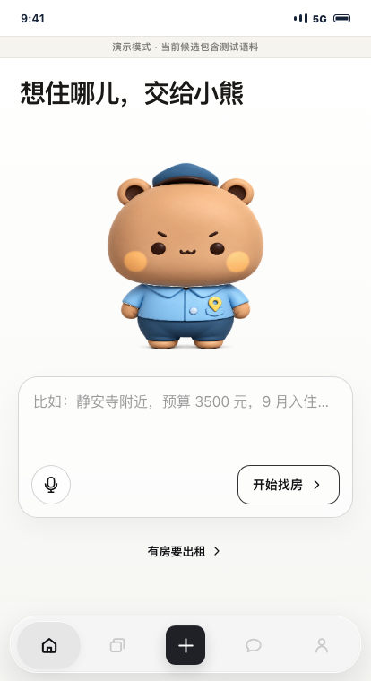
</p>

## 这个项目想解决什么

传统租房平台擅长发布信息，但发布之后的大量工作仍由人完成：确认预算、入住日期、租期、室友、设施、收费和看房时间。很多聊天只是重复补字段，真正合适与否往往要聊很久才知道。

“住哪儿”把这段流程改成了两条并行任务：

- 租客创建找房任务，确认预算、位置、入住窗口和居住偏好。
- 房东或当前租客创建出租任务，补齐房源事实、出租资格和价格边界。
- 系统持续处理新增或变化的任务，而不是只搜索一次。
- 符合硬条件的双方形成匹配案例；缺少关键信息时，系统只向能回答的一方追问。
- 双方确认同一版条件后，系统才开放联系方式和看房安排。

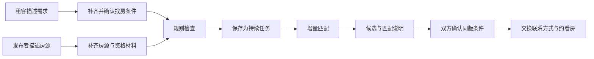

## 操作界面

下面的图片由仓库中的 `scripts/capture-showcase.mjs` 从当前代码自动生成。截图统一使用紧凑视口；协商记录和发布材料保留状态栏、页面标题以及完整内容区，不再只截取局部卡片。README 中的双列图片使用等宽列并居中展示，单列图片也统一居中；点击图片可以查看原图。截图使用 `MARKET_MODE=demo` 和虚构数据，不包含真实证件、联系方式、Cookie、API Key 或本机路径。演示候选不会生成真实的联系人授权。

### 租客端

先用一句话说明大致需求，再检查系统整理出的字段。预算、入住时间和其他条件都可以在发布前修改。

<table width="100%">
  <thead>
    <tr>
      <th align="center">整理找房需求</th>
      <th align="center">确认任务条件</th>
    </tr>
  </thead>
  <tbody>
    <tr>
      <td width="50%" align="center">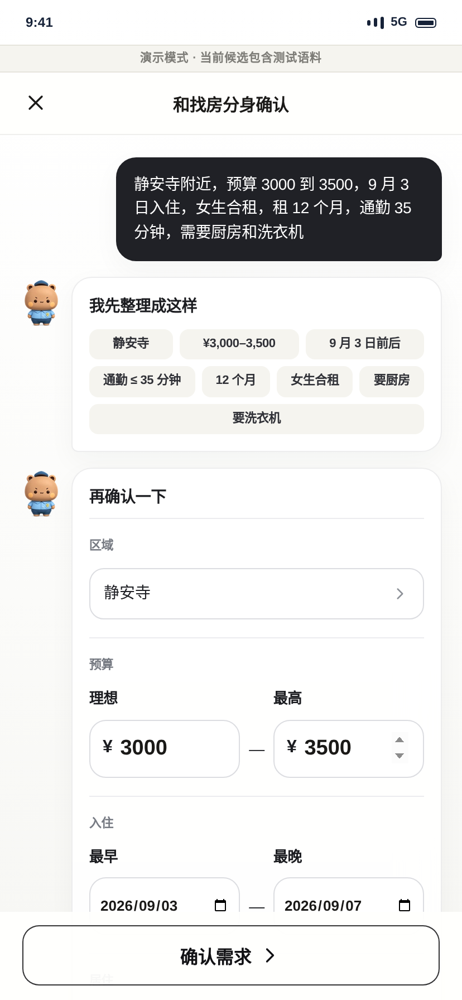</td>
      <td width="50%" align="center">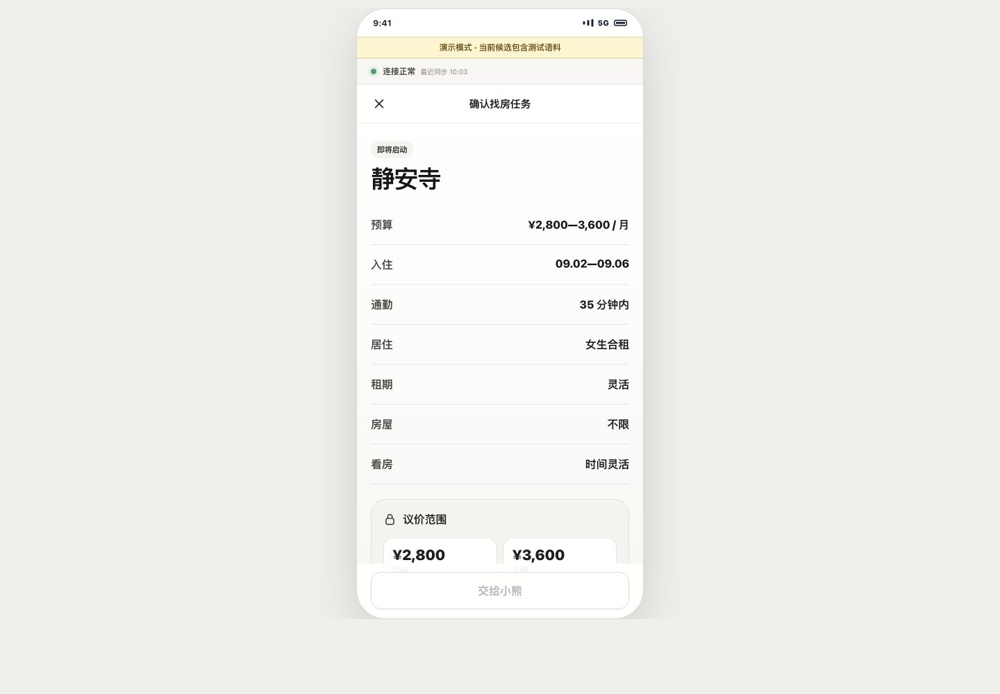</td>
    </tr>
  </tbody>
</table>

任务发布后会继续等待新房源。候选页展示当前筛选结果，并保留任务仍在运行的状态。

<table width="100%">
  <thead>
    <tr>
      <th align="center">持续匹配</th>
      <th align="center">候选房源</th>
    </tr>
  </thead>
  <tbody>
    <tr>
      <td width="50%" align="center">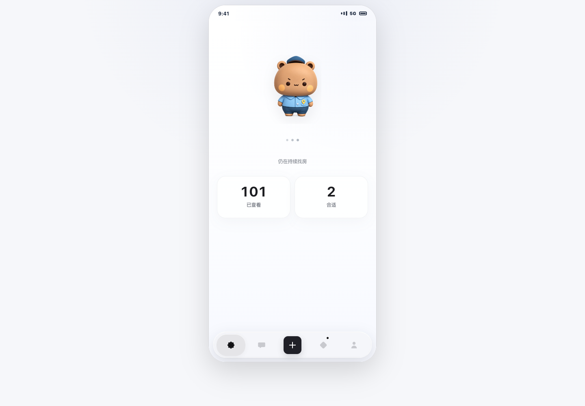</td>
      <td width="50%" align="center">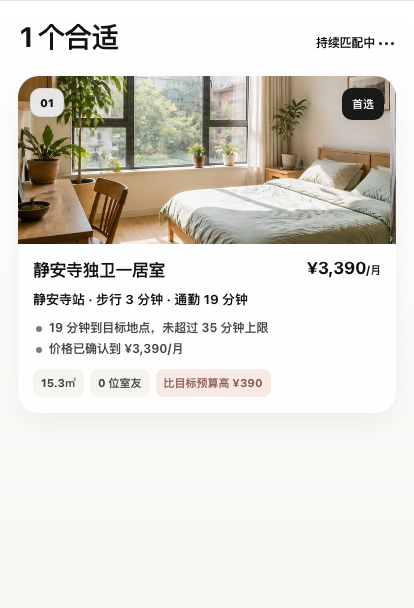</td>
    </tr>
  </tbody>
</table>

详情页会说明入选原因、需要留意的条件、资料来源和当前意向租金。协商记录只展示可以对双方公开的内容。

<table width="100%">
  <thead>
    <tr>
      <th align="center">候选详情</th>
      <th align="center">条件协商记录</th>
    </tr>
  </thead>
  <tbody>
    <tr>
      <td width="50%" align="center">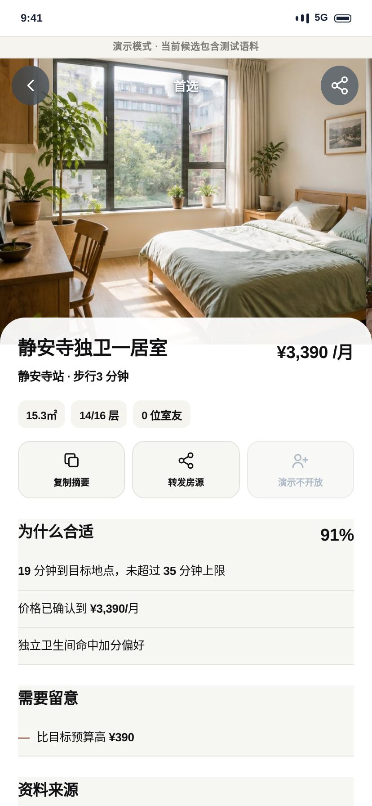</td>
      <td width="50%" align="center">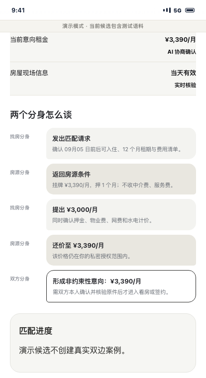</td>
    </tr>
  </tbody>
</table>

### 出租端

发布者可以选择“房东本人”或“当前租客”，然后补充位置、租金、入住时间、租期、楼层、室友和设施。最低可接受租金属于私密字段，不会直接出现在另一方的结果里。

<table width="100%">
  <thead>
    <tr>
      <th align="center">整理房源信息</th>
      <th align="center">确认房间和设施</th>
    </tr>
  </thead>
  <tbody>
    <tr>
      <td width="50%" align="center">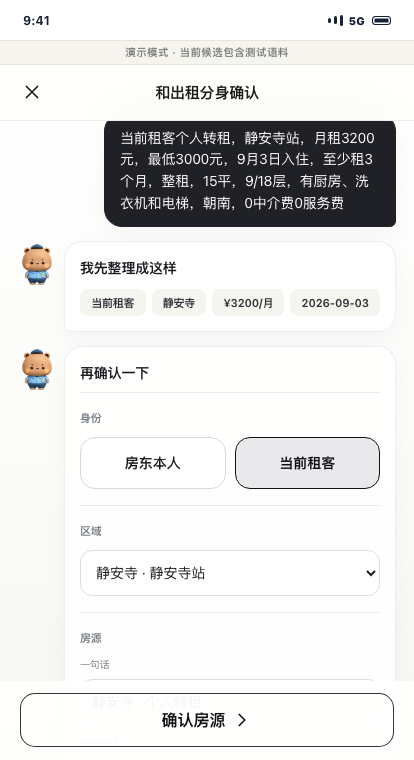</td>
      <td width="50%" align="center">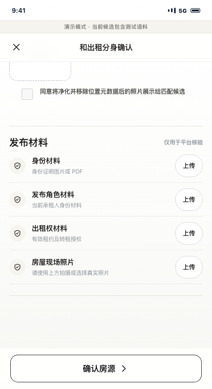</td>
    </tr>
  </tbody>
</table>

出租任务发布后也会反向匹配现有租客。对房东展示的是匿名租客信息、入住时间、租期和可以公开的意向价格，不展示租客预算上限。

<p align="center">
  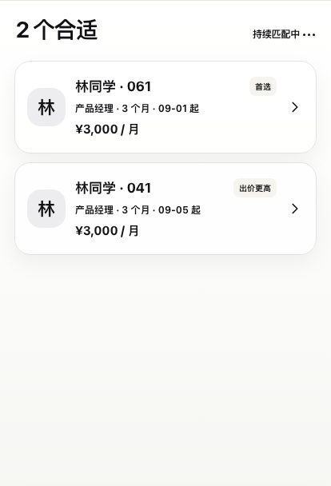
</p>

### 任务数据

任务数量、候选变化、确认进度和处理耗时来自服务端事件，不由前端估算。

<p align="center">
  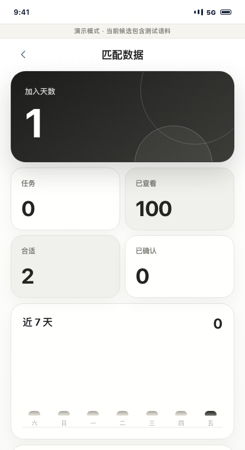
</p>

## 已经实现的流程

### 需求整理

- 租客可以描述区域、预算、入住日期、通勤、租期、合租方式、楼层、朝向、看房时间和设施。
- 出租方可以描述发布角色、位置、挂牌价、最低授权价、可入住时间、房间情况、室友、设施和费用。
- 配置 SiliconFlow 后，由 `Qwen/Qwen3.5-35B-A3B` 处理口语和省略表达。
- 没有模型 Key，或者模型超时、限流、返回格式错误时，系统会改用确定性解析。
- 模型只能补充缺失信息，不能覆盖已经从原话确认的预算、日期、角色、费用等硬字段。

### 持续匹配

- 找房任务扫描房源，出租任务也会反向扫描租客。
- 新任务、字段更新、暂停、恢复、关闭、到期和公开图片变化都会写入 outbox。
- worker 只重新计算受影响的任务对；定时器负责回收超时任务和补发异常遗漏事件。
- 任务有 `active`、`paused`、`closed` 和自动过期状态，默认有效期为 14 天。
- 候选页每 3 秒拉取一次任务快照。任务和匹配详情支持 URL 深链，刷新、后退和前进后仍能恢复。
- 每一侧最多交付三条候选。租客侧区分“首选、预算更轻、居住条件更好”，出租侧区分“首选、出价更高、租期更稳”。

### 双方确认

- 一对真实找房任务和出租任务只对应一个服务端匹配案例。
- 条件缺失时，问题只发给能回答的一方；答案写入新版本后自动重新计算。
- 双方必须确认相同的条款版本和哈希。只有一方确认时，联系方式仍然锁定。
- 条件变化、任务暂停、关闭或到期后，旧确认和联系人授权会失效。
- 联系方式解锁后可以提出看房时间，由另一方接受或拒绝。
- 消息中心保存新候选、待确认、确认完成和续期提醒。

### 房源和材料

- 只接受房东本人或当前承租人发布房源，不接受中介代发。
- 禁止中介费、服务费、信息费、带看费和签约费。
- 出租任务需要身份、发布角色、出租权和现场照片四类材料。
- `real` 模式下，四类材料必须经过服务端人工审核，任务才会进入匹配。
- 上传材料只代表“已提交”，不等于已经认证。客户端自行声明的核验状态不会被采纳。
- 私密核验材料与公开房源图片使用不同的存储和读取路径。
- 公开图片经过真实解码、自动旋转、尺寸限制和 WebP 重编码，EXIF、GPS、XMP、IPTC 元数据不会进入公开版本。

## AI 和规则各自负责什么

Qwen 负责理解自然语言，例如识别口语、同义词、省略信息并生成结构化草稿。最终业务判断仍由规则完成：

- 检查位置、价格、入住日期、合租方式、室友性别、通勤和强制设施。
- 拒绝角色冲突、中介代发、禁止收费、材料失效和异常图片。
- 防止模型覆盖用户已经确认的硬字段。
- 在结果发出前检查私密字段和敏感文本是否泄露。
- 在模型不可用时继续完成基本流程。

这个分工的目的很简单：模型可以帮助理解人话，但不能自己决定收费是否合法、材料是否有效，也不能突破用户设置的价格边界。

## 价格如何避免泄露底牌

租客最高预算和出租方最低授权价都属于私密信息。如果系统直接从两者的交集中计算一个价格，另一方可能通过多轮试探反推出底线。

因此，对外提案价只能来自房东自己公开或主动给出的数字：

| 情况 | 系统处理 |
|---|---|
| 租客上限不低于挂牌价 | 使用挂牌价 |
| 租客上限低于挂牌价 | 不生成价格，询问房东是否愿意让价 |
| 房东主动让价且租客可以接受 | 使用房东给出的让价 |
| 房东让价仍超出租客上限 | 只提示仍需调整，不告诉房东具体差额 |

房东的让价也不能低于自己的授权底价。相关限制由 `tests/pair-evaluator.test.mjs` 和候选投放测试固定。

## 技术结构

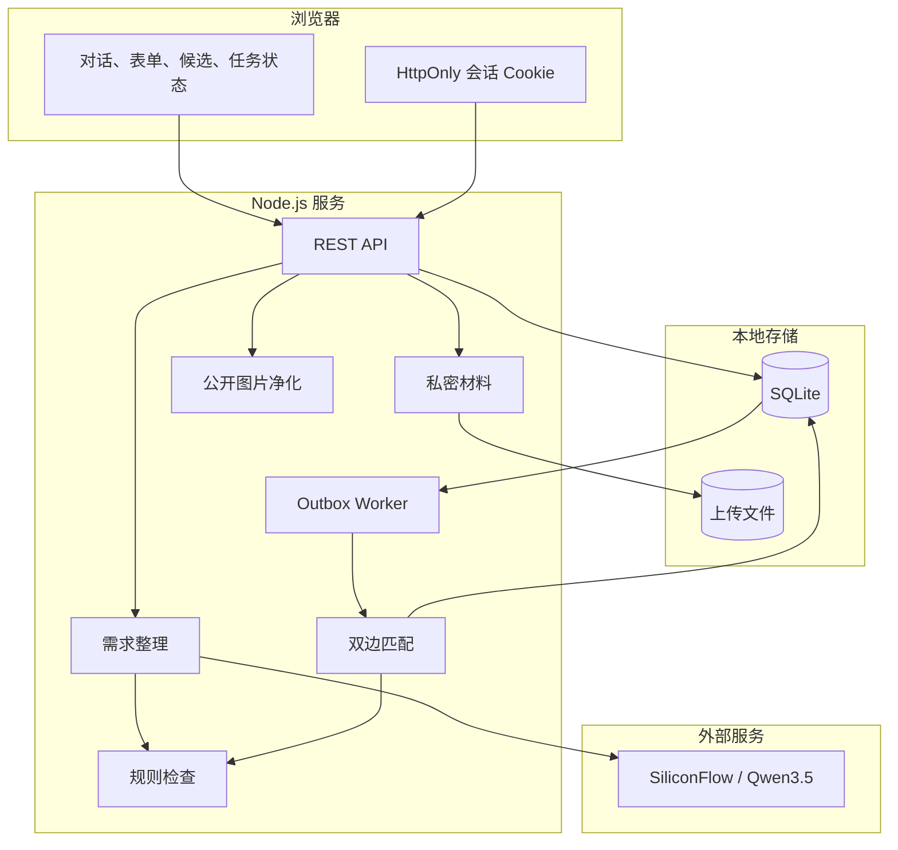

| 部分 | 主要文件 |
|---|---|
| 浏览器界面 | `src/app.mjs`、`src/app.css`、`src/ui/` |
| AI 接入 | `src/ai/`、`src/server/intake-service.mjs` |
| 规则和匹配 | `src/simulation-engine.mjs`、`src/server/pair-evaluator.mjs` |
| 持续任务 | `src/server/matching-worker.mjs`、`src/server/outbox-repository.mjs` |
| 双边案例 | `src/server/match-case-service.mjs`、`src/server/terms-service.mjs` |
| 联系人和看房 | `src/server/contact-grant-service.mjs`、`src/server/viewing-service.mjs` |
| 图片和材料 | `src/server/media-service.mjs`、`src/server/verification-service.mjs` |
| 数据库 | `src/server/database.mjs`、`src/server/migrations/` |

更完整的状态机、表结构和权限设计见 [产品与系统架构](./docs/product-architecture.md)。试点步骤见 [受控试点运行手册](./docs/pilot-runbook.md)，上线前检查项见 [安全与隐私检查清单](./docs/security-checklist.md)。

## 本地运行

### 环境要求

- Node.js 22 或更高版本，推荐 Node.js 24。
- npm。
- `real` 模式必须提供 32 字节 Base64 联系人加密密钥。
- SiliconFlow API Key 可选；不配置时使用确定性解析。

SQLite 使用 Node.js 内置的 `node:sqlite`。公开图片处理使用 `sharp`。

### 安装

```bash
git clone https://github.com/tank798/AI-native-rental-platform.git
cd AI-native-rental-platform
npm install
cp .env.example .env.local
```

在 `.env.local` 中填写本地配置：

```dotenv
MARKET_MODE="real"
CONTACT_ENCRYPTION_KEY="使用 openssl rand -base64 32 生成"

# 二选一，也可以都不配
SILICONFLOW_API_KEY_FILE="/absolute/path/to/siliconflow-api-key.txt"
# SILICONFLOW_API_KEY="your_key_here"
SILICONFLOW_MODEL="Qwen/Qwen3.5-35B-A3B"

# 可选，默认 45000 毫秒；实际超时会根据输出长度调整
# SILICONFLOW_TIMEOUT_MS=45000

# 可选。未配置时，人工审核接口返回 404
# ADMIN_REVIEW_TOKEN="random-long-token"
```

联系人密钥可以这样生成：

```bash
openssl rand -base64 32
```

已经生成的数据必须继续使用原来的联系人密钥，否则历史密文无法解开。不要把真实 Key 写进 README、`.env.example` 或提交记录。

### 启动

```bash
npm start
```

浏览器打开 <http://127.0.0.1:4173>。

如果没有配置模型，服务仍能启动，页面会提示进入安全解析模式。

### `real` 和 `demo` 的区别

`MARKET_MODE=real` 只匹配数据库中由用户创建的真实任务。一个空数据库不会凭空出现候选。

`MARKET_MODE=demo` 会加入仓库自带的虚构房源和租客，适合产品演示和生成 README 截图。演示候选有明显标记，不会创建真实双边案例，也不会开放联系方式。

无论使用哪种模式，都不要在本地演示环境上传真实身份证、房产证、租约或其他敏感材料。

## 测试

```bash
npm test
npm run check
npm run test:e2e
npm run smoke:bilateral
```

当前包含 192 项 Node 测试和 10 条 Playwright 浏览器场景，覆盖需求解析、双边任务、持续匹配、价格隐私、材料隔离、图片净化、同源检查、人工审核、联系人门禁和双账号完整流程。

双边 smoke 使用临时 SQLite 数据库，不读取项目数据库或个人 Key：

```bash
npm run smoke:bilateral
```

测试市场可以这样运行：

```bash
npm run eval:marketplace
```

当前基线使用 100 条房源和 100 条租客语料，检查 10,000 组租客配对和 8,000 组出租方反向配对。基线结果中无效候选和私密字段泄露均为 0。案例见 [matching-casebook.md](./docs/matching-casebook.md)。

配置模型后可以运行真实 Qwen 评测：

```bash
npm run eval:ai
```

## 重新生成 README 截图

界面改动后，请重新运行仓库中的截图脚本：

```bash
# 终端 A
# 截图使用确定性解析即可，显式关闭外部模型调用，避免等待模型响应
MARKET_MODE=demo SILICONFLOW_API_KEY= SILICONFLOW_API_KEY_FILE= ADMIN_REVIEW_TOKEN=readme-showcase-only PORT=4173 npm start

# 终端 B
SHOWCASE_ADMIN_REVIEW_TOKEN=readme-showcase-only node scripts/capture-showcase.mjs
```

这里的令牌只用于临时启动的本地演示服务。脚本会上传仓库内的测试图片，走完人工审核入口，等待接口和页面状态完成后再截图，并检查不同文件是否意外生成了相同内容。生成结束后仍应逐张查看，确认截图落在预期页面，且没有包含任何真实资料。

## 主要 API

除健康检查和创建会话外，接口都需要有效的 HttpOnly 会话 Cookie。写操作还必须通过同源检查，并使用 `Content-Type: application/json`。

| 方法 | 路径 | 用途 |
|---|---|---|
| `GET` | `/api/health` | 数据库、worker、AI 和处理耗时状态 |
| `POST` | `/api/session` | 创建浏览器会话 |
| `POST` | `/api/intake/renter` | 整理租客需求 |
| `POST` | `/api/intake/supply` | 整理出租信息 |
| `POST` | `/api/evidence` | 上传私密材料 |
| `POST` | `/api/tasks` | 幂等创建持续任务 |
| `GET` | `/api/tasks` | 查询当前会话的任务 |
| `GET` / `PATCH` / `DELETE` | `/api/tasks/:id` | 查询、更新状态或软删除任务 |
| `POST` | `/api/tasks/:id/media` | 授权并上传公开房源图片 |
| `GET` | `/api/media/:id` | 读取净化后的公开图片 |
| `GET` | `/api/tasks/:id/matches` | 查询任务对应的匹配案例 |
| `GET` | `/api/matches/:id` | 查询条款、澄清和确认状态 |
| `POST` | `/api/matches/:id/confirm` | 确认当前条款版本 |
| `POST` | `/api/matches/:id/decline` | 拒绝当前条款版本 |
| `GET` / `PUT` | `/api/profile/contact` | 读取掩码或保存本人联系方式 |
| `GET` | `/api/matches/:id/contact` | 在授权有效时读取对方联系方式 |
| `POST` | `/api/admin/evidence/:id/review` | 审核方通过或驳回材料 |

人工审核接口使用 `X-Admin-Review-Token`，不使用普通用户会话。未配置 `ADMIN_REVIEW_TOKEN` 时，接口直接返回 404。详细调用方式见 [产品与系统架构](./docs/product-architecture.md)。

## 数据和安全

- 浏览器首次访问时创建随机会话 secret，只通过 HttpOnly、SameSite Cookie 发送；服务端只保存哈希。
- real 模式下，联系人使用 AES-256-GCM 和逐条随机 nonce 加密。
- 任务、材料、图片和候选读取都会验证当前会话所有权。
- 写操作依次检查 `Sec-Fetch-Site`、`Origin` 和 `Referer`；三者都不存在时返回 `403 ORIGIN_REQUIRED`。
- 删除任务采用软删除。任务不再对用户可见，也不会继续匹配，但举报和双边审计记录会保留。
- 本地数据写入 `data/`，其中可能包含 SQLite、WAL/SHM、迁移备份和上传文件。该目录已被 Git 忽略，仍应按敏感数据处理。

数据库迁移位于 `src/server/migrations/`，当前 schema 版本为 10。SQLite 强制开启 WAL、外键和 5 秒 busy timeout。

## 项目结构

```text
.
├── assets/                         # 小熊素材和演示图片
├── docs/                           # 架构、试点、安全和案例文档
├── evals/                          # 模型与市场评测
├── output/playwright/              # README 浏览器截图
├── scripts/                        # smoke、指标和截图脚本
├── src/
│   ├── ai/                         # 模型接入和输出策略
│   ├── server/                     # 数据库、任务、匹配、材料和授权服务
│   ├── ui/                         # 安全渲染、路由和详情组件
│   ├── app.mjs                     # 浏览器交互
│   ├── app.css                     # 设计令牌和响应式样式
│   └── bear-agent.mjs              # 小熊分层动画
├── tests/                          # Node 和 Playwright 测试
├── index.html
├── server.mjs
└── service-worker.js
```

## 目前还不能做什么

这个仓库已经可以运行真实的双边任务、持续匹配和确认流程，但还不是可以直接处理真实租赁交易的生产系统。正式上线前仍需要：

- 手机号或实名账号、设备风控和登录安全。
- 审核员账号、权限分级、待审队列和申诉流程；目前只有受共享令牌保护的审核接口。
- 身份、产权、租约和电子签章等外部核验服务。
- PostgreSQL、备份、行级权限、私有对象存储、病毒扫描和 KMS。
- 地图、地理编码和真实路线通勤计算。
- 外部通知、短信、多设备同步、合同、支付和争议处理。
- 多模型路由、成本控制、服务监控和运营后台。

此外，材料审核结果目前会在任务创建时写入任务快照；如果材料之后被驳回，已经成立的匹配不会自动撤销。这是进入生产试点前必须补上的一项。

## 常见问题

### 为什么接入模型后还要保留规则？

模型适合理解自然语言，但租金、日期、发布角色、收费和授权会产生真实业务后果。这些条件必须由可以测试和审计的规则决定。规则也保证模型不可用时基本流程仍能运行。

### 为什么候选价格可能高于理想预算？

理想预算用于排序，最高预算才是硬限制。只要价格没有超过租客自己设置的最高预算，候选仍可能保留，并在租客页面提示差额。房东看不到这两个预算数字。

### 为什么不让租客和房东直接聊天？

这个项目就是为了减少前期重复沟通。系统先把字段、硬条件和非约束性价格意向整理好，双方确认后再交换联系方式。遇到系统无法代替人判断的问题，仍会明确交还给本人确认。

### 上传材料是否等于已经认证？

不等于。上传只说明文件已经提交。演示环境没有接入公安、产权或电子签章系统；即使通过当前人工审核接口，也只代表平台流程中的人工审核结果。

## 免责声明

本项目用于产品验证、交互设计、AI 工程和匹配策略研究。仓库中的租客、房源、租金、图片和协商记录均为测试数据，不构成真实房源、身份认证、合同、交易承诺或租赁建议。
