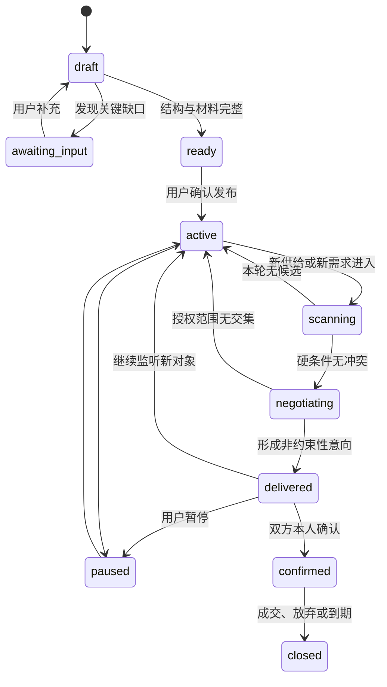
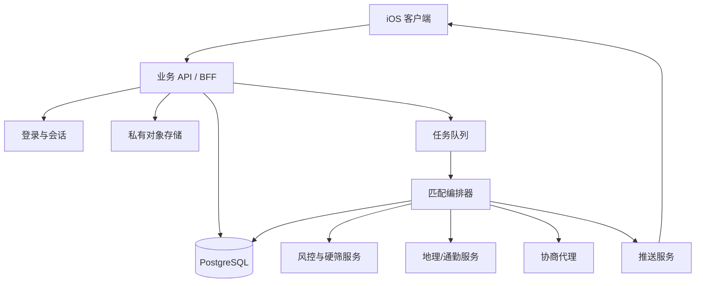
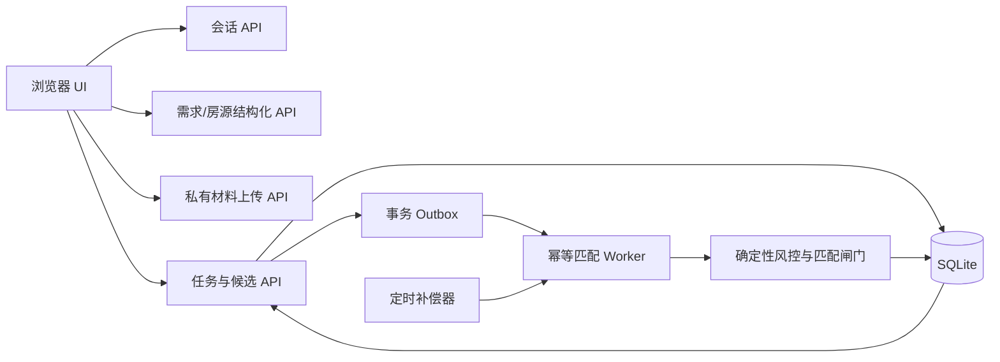

# 住哪儿：产品逻辑与系统架构

## 1. 产品定义

“住哪儿”不是一个房源社区，也不是让用户换一个地方继续私聊。它是一套双边委托系统：租客发布找房任务，房东或当前租客发布出租任务；双方本人在首批候选形成之前不直接对话，各自的 AI 分身持续完成检索、硬筛、核对、协商和结果整理。

核心指标不是帖子数或停留时长，而是：

- 从发布任务到获得首个合适候选的时间；
- 每个确认候选前被系统消化的无效往返问答数；
- 候选的硬条件冲突率、失效率和举报率；
- 双方确认、看房和最终成交的转化漏斗。

## 2. 信息架构

底部固定为四个顶层页面，中间加号是独立动作，不承担导航：

| 入口 | 作用 |
| :---: | :---: |
| 首页 | 展示小熊分身的持续工作状态、已查看数量和合适数量 |
| 候选 | 集中承载房源候选或租客候选，以及双方 AI 的协商摘要 |
| `+` | 新建“我要找房”或“我要出租”任务 |
| 消息 | 展示新候选、双方确认、举报进度和任务到期续期提醒 |
| 我的 | 账号、历史任务、匹配数据和设置 |

“找房 / 出租”不再是覆盖整个 App 的模式切换。它们是任务类型。用户通常只有一个活跃任务，但数据模型允许同时保存多个历史任务，并在需要时重新启用。

## 3. 两条主流程

### 3.1 找房任务

1. 用户用文字或语音描述需求。
2. 系统抽取原话中的事实，并用一轮对话式确认补齐或确认全部匹配字段。
3. 位置通过地图选择商圈、地铁站、小区或自定义范围；通勤目的地单独保存。
4. 用户确认硬条件、偏好、可协商项和仅自己可见的预算授权。
5. 任务进入持续运行状态，首页显示小熊工作状态、已查看量与合适量。
6. 首批候选出现后，任务仍继续监听新房源，直到用户暂停、成交或到期。

### 3.2 出租任务

1. 用户选择“房东本人”或“当前租客”。
2. 填写地址、租金、入住日、租期、室友与设施。
3. 通过系统相机或照片选择器上传房源媒体；原件进入私有存储。
4. 身份、发布角色、出租权和房源现场分别建立证据记录。
5. 用户确认挂牌价、私密底价和零中介费承诺。
6. 任务进入持续运行状态，对新租客委托执行同一套对称匹配。

## 4. 任务状态机

UI 不显示虚构的百分比进度，也不堆叠后台阶段说明。已知总量的批处理显示“已查看 n 个”；长期监听只保留持续匹配状态，候选按真实运行结果逐步进入候选页。

## 5. 匹配流水线

### 5.1 统一结构

每条任务都拆成三类字段：

- **硬条件**：角色、零收费、位置范围、通勤上限、预算上限、入住窗口、租期、整租/合租、室友性别、必须设施、宠物与无障碍要求；
- **偏好**：朝向、楼层、装修、洗衣机类型、民水民电、室友数量等；
- **可协商项**：目标价、私密上限或底价、提前起租、延长租期、押金方式等。

字段同时保存原始证据、标准化值、置信度、更新时间和可见范围，避免只保存一段 AI 总结。

### 5.2 风控优先

角色、收费、出租权、重复图片和材料冲突先于相关性匹配。风险对象不能通过“分数高”绕过规则。一次无证据举报先让房源退出新匹配并进入复核；站内收费、实名角色冲突或伪造材料等客观证据命中后，再执行账号与实名主体级处罚。

### 5.3 地理与通勤

生产版本不依赖字符串相等：

- 地图选择结果保存为点、半径、多边形或地铁站 ID；
- 通勤目的地保存为坐标与到达时段；
- 召回使用地理索引；
- 候选进入硬筛前，用路线矩阵计算门到门通勤；
- 路线结果带计算时间和交通方式，过期后重新计算。

### 5.4 确定性硬筛

以下判断必须由规则执行，而不是由生成式输出决定：

- 角色是否只属于房东本人或当前租客；
- 是否存在任何中介费、服务费、信息费、带看费或签约费；
- 位置、通勤、预算、入住日、租期、整租/合租和室友性别是否冲突；
- 必须设施、宠物、无障碍与房源时效是否满足；
- 私密预算上限或底价是否被越过。

### 5.5 协商与交付

AI 只在双方已经授权的交集内交换条件。公开事件只保留报价、租期、入住日和条件，不展示隐藏推理，也不向对方暴露上限或底价。最终候选按“综合、预算、居住条件”等不同目标去重，最多交付少量真正有差异的结果。

## 6. 实时系统架构

客户端只负责采集、展示和用户确认。服务端负责私密授权、匹配、风控、协商、事件持久化和推送，不能把底价、证件或服务端密钥放在客户端。

### 6.1 当前可运行的本地闭环

仓库里的 Web 版本已经把上述职责压缩成可直接运行的本地服务：

`npm start` 会启动 `server.mjs`。服务端创建浏览器会话，并把任务变化与匹配事件放在同一 SQLite 事务提交；单进程 worker 领取事件后只重算受影响任务对。定时器只负责租约回收、任务到期、遗漏事件补偿和过期数据清理，不再周期性全量扫描。前端负责输入、材料选择、状态展示和本人确认；对方公开候选只接收经过 allowlist 组装的公开字段。默认结构化使用确定性解析；配置 SiliconFlow Key 后，模型补充自然语言字段，规则结果和用户确认值保持最高业务优先级。

市场数据通过 `MARKET_MODE` 明确分流：默认 `real` 模式只扫描数据库中的真实用户任务；`demo` 模式额外加载 100×100 测试语料，并在界面持续显示演示标识。演示候选带 `counterpartyType=fixture`，后续双边案例服务据此保持真实案例边界。两个模式不会在同一个未标识结果集中混合。

当前闭环的验证范围是本地单进程服务：SQLite 承载业务数据与事务 outbox，本地隔离目录承载私密材料、公开图片原件与净化 derivative，前端轮询读取最新结果。worker 用 `BEGIN IMMEDIATE` 和 `locked_at` 短租约实现单机竞争领取、指数退避和崩溃恢复；它是可替换的队列边界，不等同于多机消息系统。联系人以 AES-256-GCM 应用层密文保存；双方同版确认后，服务端才签发绑定条款哈希和双方输入版本的短期授权。公开图片只有在发布者明确同意后，才经过真实解码、旋转、限边、WebP 重编码和元数据清除进入候选。生产迁移将这些适配器替换为 PostgreSQL、私有对象存储、队列、推送和 KMS 包络加密，同时保持 `owner_id` 隔离、服务端证据引用校验、公开字段脱敏和 real/demo 分流语义。

### 6.2 SQLite 版本与升级边界

本地数据库使用 `PRAGMA user_version` 管理连续版本，当前 schema 版本为 8。迁移顺序由 `src/server/migrations.mjs` 显式声明，对应 SQL 文件为：

1. `001-baseline.sql`：保留 v0.6 会话、材料、任务、候选和审计事件结构。
2. `002-task-fields-and-outbox.sql`：增加任务输入版本、字段级真值和去重 outbox。
3. `003-bilateral-match-cases.sql`：增加双边案例、条款、澄清、确认、联系授权、媒体和案例事件表。
4. `004-clarification-answer-spec.sql`：为每个澄清问题固化可回答类型、范围、枚举选项和问题生成来源。
5. `005-confirmation-input-versions.sql`：让确认记录绑定双方任务输入版本，并保留撤销后的历史记录。
6. `006-contact-grant-snapshots.sql`：让联系人授权绑定条款哈希、双方输入版本和有效期，并保留撤销历史。
7. `007-listing-media-metadata.sql`：补充公开图片双哈希、尺寸、说明、内容去重索引和独立清理队列。
8. `008-transactional-matching-worker.sql`：增加 outbox worker 租约归属、失败时间、配对幂等作业和健康状态。

每个版本在独立 SQLite 事务中执行；SQL 执行和 `user_version` 更新共同成功后才提交。程序读到更高版本时会拒绝启动，保护新 schema 免受旧程序写入。有表的旧库升级前会先执行 WAL checkpoint，再在同目录生成 `<database>.pre-v<version>.bak` 备份。

连接统一开启 `foreign_keys=ON`、`journal_mode=WAL` 和 `busy_timeout=5000`。数据目录权限为 0700，SQLite 文件与迁移备份权限为 0600。任务对、open 澄清字段、同版条款确认、当前有效联系人授权和 outbox dedupe key 都由数据库唯一约束保证幂等。

## 7. 数据库与用户隔离

需要数据库，而且不是“每人一个数据库”。本地闭环用 SQLite 验证数据流，生产更合适的方案是同一套 PostgreSQL 中所有用户数据带 `owner_id`，再用行级安全策略做强制隔离。对象存储也按用户与任务分路径并设置同样的访问规则。

本地服务的版本化 schema 已落地会话、材料提交与人工审核、任务与字段真值、候选、双边案例、条款、澄清、确认、联系授权、媒体、outbox、配对作业和审计事件表。任务创建、字段版本变化和状态变化与对应 outbox event 原子提交；`clientRequestId` 和事件 dedupe key 防止首次响应丢失后的重复写。worker 先按相反类型、城市、粗位置、可计算通勤和授权价格做保守粗筛，未知值不会被误排；最终仍由 pair evaluator 判定。每个 job key 同时绑定双方输入版本与 evaluator 版本，写候选前再次读取当前版本，过期计算只记为 stale，不覆盖新状态。案例 API 先确认调用者是租客或出租方，再只返回本人待回答问题；对方问题仅返回数量和粗粒度类别。公开条款经过字段 allowlist、规范化 JSON 和 `sha256:` 哈希；双方确认同时绑定条款版本、哈希和两侧任务输入版本。任一条款或输入版本变化都会撤销旧确认和联系人授权，双方只有确认同一份文档后才进入 `mutually_confirmed`。联系人原值以随机 nonce 的 AES-256-GCM 信封保存，列表和设置接口只返回掩码；读取接口实时复核案例、条款、输入版本、双方确认、任务状态和授权有效期，只向当前会话返回对手方联系人。公开图片读取同样不是静态目录：服务端要求当前会话是发布者或确有该房源候选的接收方，并再次检查任务有效、公开授权、净化完成和未删除。API 层会在每次读取任务、证据、媒体和匹配案例时检查当前会话的 `owner_id` 或明确双边可见关系；生产 PostgreSQL 适配器将同一所有权语义下沉为数据库 RLS，并沿用相同的服务端公开投影边界。

### 7.1 核心表

| 表 | 关键内容 |
| :---: | :---: |
| `profiles` | 用户公开资料与账号状态 |
| `identities` | 实名核验状态；证件原件不放公开表 |
| `rental_tasks` | 任务类型、拥有者、状态、有效期 |
| `renter_requirements` | 硬条件、偏好、可协商授权 |
| `listings` | 房源事实、公开位置、私密精确地址引用 |
| `listing_media` | 私有原图、公开 derivative、原始/净化哈希、尺寸、授权与媒体状态 |
| `media_cleanup_queue` | 任务删除后的文件清理租约、尝试次数与完成状态 |
| `verification_cases` | 身份、角色、权利和现场证据 |
| `match_runs` | 每轮匹配的输入版本与运行状态 |
| `match_candidates` | 供需配对、规则结果、评分和交付状态 |
| `negotiation_events` | 结构化报价、条件与双方可见范围 |
| `reports` | 举报、证据、复核与申诉 |
| `enforcement_actions` | 下架、冻结、封禁及关联主体 |
| `audit_events` | 不可变的关键业务事件 |
| `stats_daily` | 从事件聚合出的个人统计数据 |

### 7.2 隔离原则

- 用户只能读写 `owner_id = 当前登录用户` 的任务、授权和私有媒体；
- 候选只有在服务端创建明确的双边可见关系后，双方才能读取各自被允许的摘要；
- 精确地址、身份材料、预算上限和房东底价放在独立私有表或加密字段中；
- 协商服务只拿完成当前判断所需的最少字段；
- 管理端使用独立角色、短期凭证和完整审计，不复用普通用户权限；
- 所有表默认拒绝访问，再分别开放 `SELECT / INSERT / UPDATE / DELETE` 策略并测试跨用户越权。

## 8. 地图与媒体的产品实现

### 地图

Web 原型展示了地图式选择、范围半径、搜索和系统定位入口。原生 iOS 版本使用 MapKit 的搜索、定位、标注与路线能力；用户选择的不是一段文字，而是稳定的地点 ID 与几何范围。

### 相机与相册

Web 原型已经使用系统文件选择器与相机入口。原生 iOS 版本分别调用相机和系统照片选择器，只获取用户明确选择的媒体。当前服务端会严格解码 base64，使用 Sharp 检查真实格式、像素和动画页数，自动旋转并把最长边限制为 2000 px，再重编码为不含 EXIF/GPS/XMP/IPTC 的 WebP。原件保存在 0700 私有目录，公开 derivative 只能经受控 ID 路由读取；未明确同意公开、任务已失效或没有候选关系时均返回 404。任务删除后媒体立即软删除并写入清理队列，后续补偿器负责物理文件回收。

## 9. 事件与统计

统计面板不直接查询当前页面状态，而从事件聚合：

- `task.created`：新增一次任务；
- `candidate.scanned`：已查看量；
- `candidate.eligible`：硬条件合适量；
- `candidate.delivered`：交付量；
- `candidate.confirmed`：双方确认量；
- `conversation.avoided`：被结构化问答或自动协商替代的往返次数；
- `report.confirmed`：确认违规量。

这样可以回放漏斗、解释数字来源，并避免统计和真实业务状态不一致。

## 10. 评测矩阵

当前原型维护 100 条出租文案、100 条找房文案和对应真值；找房端执行 100 × 100 的 10,000 组配对，出租端执行 80 × 100 的 8,000 组配对，并把 200 条“输入—输出”保存在 `docs/matching-casebook.md`。生产前至少持续覆盖：

1. 完整匹配；
2. 位置相似但通勤超限；
3. 预算刚好相交；
4. 双方授权无交集；
5. 提前起租换取降价；
6. 延长租期换取降价；
7. 整租与合租冲突；
8. 室友性别冲突；
9. 租期不足；
10. 入住窗口冲突；
11. 电梯、独卫、厨房、洗衣机硬冲突；
12. 宠物与无障碍冲突；
13. 民用水电未知；
14. 房东角色材料缺失；
15. 当前租客合同过期；
16. 中介身份伪装；
17. 收取任一种禁止费用；
18. 重复或盗用图片；
19. 房源已失效；
20. 多次举报关联同一实名主体；
21. 私密上限或底价泄露尝试；
22. 跨账号读取任务、媒体或候选；
23. 后台任务重试与幂等；
24. 地图路线结果过期后重算。

## 11. 分阶段落地

### 阶段一：可用闭环

账号、数据库、任务状态机、地图选择、媒体上传、确定性匹配、候选交付和推送。

### 阶段二：可信闭环

身份与权利核验、重复图片检测、举报复核、实名关联处罚、候选时效和审计回放。

### 阶段三：交易闭环

双方确认、预约看房、合同与支付能力。前两阶段稳定前，不让社区、公开评论或流量分发稀释核心匹配效率。
